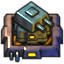
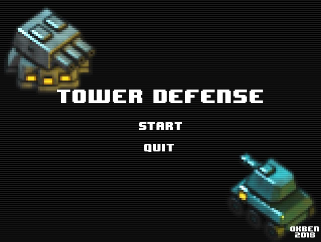
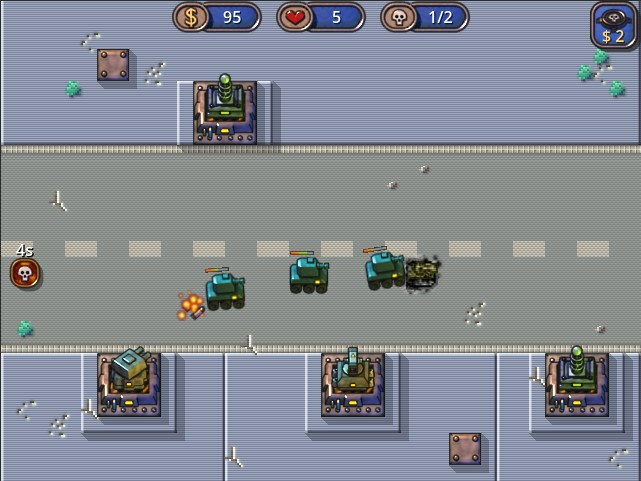

# TowerDefense
Simple Tower Defense Game made with [Godot Engine](https://godotengine.org).

## Authors

Oxben <oxben@free.fr>

## Requirements
* Godot Engine 4.6+

## Screenshots

## Source tree
* assets/              : Source files used to produce the assets (.blend, .xcf, ...)
* TowerDefense/        : The Godot project (project.godot, scenes and gdscripts)
* TowerDefense/assets/ :  The assets in their final state

## Assets

All of the assets in the project have been created with open source tools.
Thank you Blender, Inkscape, Gimp and Krita.